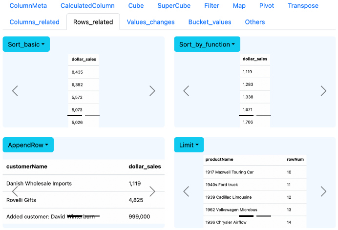

# Introduction

This repository contains KoolReport examples for processes.

Demo: [https://www.koolreport.com/examples-processes](https://www.koolreport.com/examples-processes)



# Installation

Clone or download the repository source code into your machine:

```
git clone https://github.com/koolreport/examples-processes.git
```
If you have not installed KoolReport, go to the source code directory and run composer to install KoolReport:

```
cd path/to/examples-processes
composer install
```

Open and edit the file `common.php` to require the `autload.php` file 
which includes KoolReport installation:

```
require_once "path/to/vendor/autoload.php";
// or
// require_once "path/to/koolreport/core/autoload.php";
```

Finally, put the repository source code on your web server to serve it

# Source code structure

The source code includes an `assets` subdirectory of css/js files, a `data` subdirectory of csv/excel/sql data files 
and most importantly a `reports` subdirectory of report source code files which you could copy and use for your project.


# About KoolReport

KoolReport is an intuitive and flexible Open-Source PHP Reporting Framework for faster and easier report delivery. It gives you full control of data process as well as data visualization. It is fast, simple and can be extended in many ways.

KoolReport core is free and open source released under MIT license.

* Website: [https://www.koolreport.com](https://www.koolreport.com/)
* Documentation: [https://www.koolreport.com/docs](https://www.koolreport.com/docs)  
* Online Examples: [https://www.koolreport.com/examples](https://www.koolreport.com/examples/)